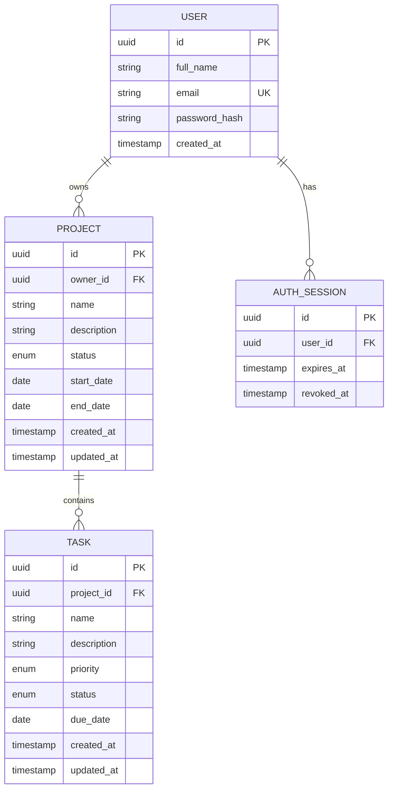

# Project management system: implementation and verification plan

Prepared 8 October 2026. Source: all seven pages of Intern_Task_Full_Stack_Developer.pdf. The workspace currently contains the assignment PDF and no application code. This is a proposed plan, not a completed implementation or test report.

## 1. Scope and approach

Deliver a responsive web application and an installable Android application using one REST backend and one relational database. Prioritize correctness, usability, security, and explainable code. iOS is optional. Cross-platform synchronization is required after refresh; realtime infrastructure is unnecessary for acceptance.

Use only synthetic users and project/task data. Every feature must have an acceptance check. Keep a requirements checklist linked to implementation files, tests, and submission evidence as work progresses.

## 2. Proposed stack

| Layer | Choice | Purpose |
|---|---|---|
| Repository | pnpm TypeScript monorepo | One public repository, shared contracts, reproducible scripts |
| Web | React + Vite, React Router | Meets the allowed React choice; clear separation from the required backend |
| Web styling | Tailwind CSS + accessible component primitives | Consistent responsive forms, dialogs, tables, focus behavior |
| Mobile | React Native + Expo + Expo Router | Android-first delivery and a familiar TypeScript workflow |
| Client data | TanStack Query | Fetching, loading/error states, invalidation and refresh |
| Forms | React Hook Form + shared Zod schemas | Useful client feedback; server independently enforces validation |
| Backend | NestJS | Modules, authentication guards, middleware, REST organization and logging |
| Database | PostgreSQL + Prisma | Relational constraints, parameterized access, migrations and typed queries |
| Documentation | OpenAPI/Swagger + README + Mermaid ER diagram | Inspectable API contracts and reproducible setup |
| Verification | Jest/Supertest, React Testing Library, Playwright, Android device/emulator | Backend, client behavior, browser flows and actual Android delivery |
| Delivery | GitHub Actions; web on Vercel; containerized API and managed PostgreSQL | CI and separate web/API URLs while retaining one backend |

Choose supported compatible package versions at initialization and commit the lockfile. Do not copy version-specific setup from an old tutorial. API hosting provider selection remains a setup decision based on available accounts, cost and database connectivity; the plan does not assume a free hosting tier.

Suggested layout:

```text
apps/web
apps/mobile
apps/api
packages/contracts
packages/design-tokens
docs/requirements.md
docs/api.md
docs/architecture.md
docs/testing.md
docs/demo-script.md
```

Share domain types, enums, validation and API contracts. Share colors and spacing tokens where useful; build web and mobile UI components for their own platforms.

## 3. Complete requirement coverage

| Brief condition | Planned implementation | Acceptance evidence |
|---|---|---|
| Register/login/logout; full name, email, password | Auth screens on both platforms and the four required auth routes | Register on web, login on Android, and reverse the flow |
| Unique emails; hashed passwords | Normalize email and enforce DB uniqueness; bcrypt password hashing | Concurrent duplicate registration rejected; DB contains hashes; hashes omitted from responses |
| Login persists until logout/expiration | Persist secure sessions, validate at startup, clear state on expiration/logout | Restart client, reload web, expire token, log out and replay token |
| Project create/read/edit/delete/list own | Project forms, list and detail view; owner-filtered API | CRUD and second-user denial tests |
| All project fields | Name, description, Not Started/In Progress/Completed, start/end dates, server-created date | Round-trip values and reject invalid dates/status |
| Task create/read/edit/delete/complete/list by project | Task screens/forms plus project-scoped task queries | CRUD, completion and association tests |
| All task fields | Name, description, Low/Medium/High, Pending/In Progress/Completed, due date, server-created date | Round-trip values and invalid enum/date checks |
| Five dashboard statistics | Total projects/tasks, completed tasks, pending tasks, projects in progress | Seeded counts, owner isolation, refresh after changes |
| Search projects/tasks by name | Server search parameters with debounced client inputs | Matching/nonmatching names and search combined with filters |
| Project status filtering | Status query parameter and accessible selector | Each status returns correct owned projects |
| Task status and priority filtering | Combined status/priority/search/project query parameters | Individual and combined filter tests |
| Android app; same backend/database/account | Expo Android build uses the same public API URL | Install APK and run against deployed API |
| Mobile dashboard, projects and project tasks | Dashboard, projects and detail screens | Physical-device acceptance walkthrough |
| Mobile task CRUD, completion, status and priority | Native task editor and actions | Create/edit/delete on Android; verify web after refresh |
| Mobile task search/filter | Search input, filter sheet, visible active filters | Matching results and clear-filter behavior |
| Cross-platform refresh | Invalidate on local mutations; mobile pull-to-refresh; web refetch/refresh | Web-to-mobile and mobile-to-web verification |
| Secure mobile tokens | Expo SecureStore, never AsyncStorage/plain local storage for credentials | Storage implementation review and restart/logout checks |
| Expired mobile login | Central 401 handler clears session/cache and returns to login with message | Expiration while active and on cold start |
| No network handling | Offline banner, failed-request message and explicit retry | Airplane-mode and API-unavailable checks; no crash/blank screen |
| Responsive web, structure, forms/loading/errors | Feature folders and common UI states | Browser/mobile viewport tests and accessibility review |
| Mobile navigation/forms/loading/pull-to-refresh/errors | Auth guard, stack navigation, safe areas and native inputs | Back behavior, keyboard, slow network, refresh and validation checks |
| REST, middleware, routes, errors, logging | Nest modules, request IDs, structured sanitized logs, exception filter | Route contract tests and log review |
| CORS for web domain | Explicit development and deployed origin allowlist | Allowed origin succeeds; foreign origin rejected |
| PostgreSQL/MySQL; normalized relationships | PostgreSQL users/projects/tasks with foreign keys and indexes | Migration and constraint tests; ER diagram |
| JWT, protected routes, ownership | JWT validation plus active-session validation; ownership enforced on every read/write | Missing/invalid/expired/revoked tokens; cross-user ID attacks |
| Validate every backend input | Shared schemas invoked server-side; validate bodies, query params and path IDs | Required/blank/email/date/enum/oversized input tests |
| No sensitive response data | Explicit response DTOs and log redaction | Assert passwords, hashes, tokens and secrets absent |
| SQL injection protection | ORM parameters; no interpolated user-supplied SQL | Injection probes and query review |
| Authentication rate limiting | IP-based login/register throttling; correct proxy configuration | Repeated requests yield 429 and recover after window |
| Easy setup and all required docs | README, env examples, migrations/seed, API docs, Android deployed-API instructions | Fresh clone setup by following only README |
| All seven submission artifacts | Release checklist below | Verify every artifact from evaluator perspective |

Mobile project CRUD is not explicitly required in the mobile-specific list. Complete web project CRUD and mobile project viewing first; add mobile project CRUD for parity if time permits.

## 4. Product and UI/UX design

Aim for a calm productivity interface: neutral surfaces, one primary accent, readable typography and consistent spacing. Status/priority have text labels as well as colors. Favor useful task information over decorative charts.

Web screens: registration, login, dashboard, projects list, project detail with tasks, project create/edit, task create/edit, optional all-tasks screen. Desktop navigation uses a sidebar; narrow screens use compact navigation and cards instead of compressed tables. Project cards show status, dates and completed/total task progress. The dashboard displays the exact five required counters, with optional recent tasks.

Mobile screens: registration/login, dashboard, projects, project detail/tasks, task editor, and account/logout. Use bottom navigation for major destinations and stack navigation for details. Give primary actions large touch targets, respect safe areas, keep inputs visible above the keyboard, and show active filters clearly.

Reusable states: loading skeleton, empty list with next action, no search results with clear filters, field-level validation, recoverable error with retry, offline message, session-expired message, and delete confirmation. Preserve draft input after failed requests. Disable duplicate submissions and show success only after server confirmation. Delete confirmation should explain that deleting a project deletes its tasks.

Accessibility targets: keyboard navigation, visible focus, correctly labeled inputs, screen-reader names, contrast checks, scalable text, and roughly 44-48 pixel touch targets. Include screen-reader checks on Android. Test 360px web width and desktop sizes; avoid horizontal overflow.

Design outputs before full implementation: screen map, principal wireframes, reusable component inventory, tokens, and loading/empty/error variants. Figma is optional; local reviewable designs can be used if it is not connected.

## 5. Database and semantics

Core entities:



Derive task ownership through its project; never trust a client-supplied owner ID. Index project owner/status and task project/status/priority, and tune name search only if needed. Cascade project deletion to tasks through foreign keys. Do ownership checks and mutations atomically to avoid check/write gaps.

Working interpretations to document because the PDF leaves them unspecified:

- Pending Tasks counts status Pending only; show In Progress separately if useful.
- Project status is explicitly editable, not automatically changed when a task completes. Task progress is derived separately.
- Business dates use YYYY-MM-DD; creation timestamps use server-generated UTC timestamps. Reject impossible dates and end dates before start dates. Allow overdue tasks.
- Require names and dates in forms; allow an empty description. Document field limits and defaults consistently.
- Deleting a project deletes its tasks after confirmation. Baseline updates use last successful write; conflict detection can be added later.

## 6. API and security design

Required route inventory, preserving the exact verbs in the brief:

```text
POST /api/auth/register
POST /api/auth/login
POST /api/auth/logout
GET  /api/auth/me
GET  /api/projects
GET  /api/projects/{id}
POST /api/projects
PUT  /api/projects/{id}
DELETE /api/projects/{id}
GET  /api/tasks
GET  /api/tasks/{id}
POST /api/tasks
PUT  /api/tasks/{id}
DELETE /api/tasks/{id}
GET  /api/dashboard
```

Project list supports search and status. Task list supports projectId, search, status and priority. Add bounded pagination and allowlisted sorting as early bonuses. Clients change completion/status/priority through PUT /api/tasks/{id}; separate action routes are unnecessary. Define whether PUT requires the complete editable representation and make both clients comply.

Use 201 for creation, 200 for reads/updates, 204 for delete/logout, 400 for invalid input, 401 for invalid sessions, 404 for missing or unowned resources, 409 for duplicate email, and 429 for throttling. Publish examples and typed errors such as code/message/fieldErrors/requestId. Return DTOs rather than database objects.

Auth baseline: JWT includes subject, session ID and expiration. Persist an auth-session record; validate signature, allowed algorithm, issuer/audience/expiry and active session on protected routes. Logout revokes that session, so copied tokens stop working. Do not implement logout as client-side deletion alone.

Web: use an HttpOnly, Secure cookie in deployment and no browser localStorage token. Prefer same-site web/API domains; for a same-origin API proxy, forward to the same Nest backend rather than adding business logic. Enforce CSRF protection on cookie-authenticated mutations and explicit credentialed CORS where requests are cross-origin. Mobile: Bearer JWT stored in Expo SecureStore. Both transports authenticate against the same auth module and user table.

Central session handling clears all per-user caches at logout/expiry. Never treat ordinary offline errors as expired sessions. Keep refresh tokens optional; if added, rotate hashed refresh tokens, detect reuse, revoke on logout and test both transports.

Other controls: backend schema validation, maximum input/body sizes, password policy and bcrypt input-length handling, generic invalid-login responses, parameterized queries, HTTPS, secret validation on startup, security headers, explicit CORS allowlists, and redacted request logging. Test ownership for task reassignment as well as ordinary CRUD. Rate-limiter storage must work across instances if the deployed API is replicated.

## 7. MCPs, plugins and skills

Use tools for specific jobs; more integrations do not automatically improve the submission.

| Capability | Role in this project | Verified availability / constraint |
|---|---|---|
| PDF skill + local runtime | Extract/check assignment and maintain coverage | Used to inspect this brief |
| Figma plugin/MCP | Editable screen designs, component states and implementation comparison | Installed after planning; tools are available for the design phase. Verify target file/team access when creating designs. |
| GitHub plugin + CLI | Repository, issues if useful, PR inspection, CI and release artifacts | Plugin reported installed; account access must be checked when used |
| Vercel plugin/tools | Web preview/deployment and deployment inspection | Plugin reported installed; project/account access must be checked when used |
| Vercel backend/env/deployment skills | Hosting decisions, secrets, deployment configuration | Available; read relevant skills at implementation time |
| React best-practices skill | Review component structure, hooks, accessibility and performance | Available; apply after multiple TSX edits |
| Verification skill | Follow the full browser-to-API-to-database flow | Available; apply when starting/testing the application |
| Browser computer-use tool | Inspect UI states, navigation and deployed behavior | Available browser surfaces; not an Android automation tool |
| Playwright via local CLI | Repeatable browser end-to-end and visual/accessibility checks | Proposed dependency; install/configure at implementation time |
| Android emulator/device + Android testing tools | APK acceptance, secure storage, network loss and mobile navigation | Device/emulator tooling not verified yet |
| Cognee codebase/memory | Optional architecture recall and impact analysis | Server currently unreachable; not a dependency for completion |
| Mermaid | Versioned architecture and ER diagrams | Plain files; no external account needed |

No direct database MCP is necessary: migrations and integration tests provide reproducible database work. If a provider-specific database MCP becomes useful, discover its actual availability and use a test database. Never claim an MCP was used when work actually ran through a CLI. Avoid adding Sites hosting, external authentication, AI features or image assets solely to increase tool count; this assessment rewards the specified architecture and explainable implementation.

### Additional tooling decisions

- Figma + its available MCP tools: use for dashboard, web and Android screen designs, tokens, reusable components, and loading/empty/error states before implementation.
- Context7: use version-matched documentation for React/Vite, Expo, NestJS, Prisma and UI libraries. Plugin discovery reports it installed, but callable tool access still needs verification. Official documentation remains the fallback. The proposed frontend is React/Vite; Next.js is an allowed alternative, not a necessary change for these tools.
- Playwright MCP: optional for exploratory browser journeys and UI debugging. Its tools are not currently exposed in this session. Keep regular Playwright tests in the repository and CI regardless. Existing browser tools and the CLI can cover much of the same work.
- Expo MCP: useful for Expo guidance, compatible dependencies, EAS workflows and supported local debugging. Requires an Expo account and MCP authentication; local capabilities require project/dev-server setup. Verify actual Android/Windows automation support before depending on it for phone testing. Keep Android emulator/physical-device acceptance tests and SecureStore regardless. Some server tools require a paid EAS plan.
- shadcn/ui + Tailwind: adopt for web components and styling, replacing the generic web component-primitives choice above. Customize tokens and component states to the Figma designs. Use native React Native components on Android, sharing design tokens rather than web DOM components.

References: https://developers.figma.com/docs/figma-mcp-server/ ; https://context7.com/docs/overview ; https://github.com/microsoft/playwright-mcp ; https://docs.expo.dev/mcp/ ; https://ui.shadcn.com/docs/installation/vite

## 8. Execution sequence and completion gates

Planning estimate: 10-14 focused working days for one developer, depending on familiarity and account/build setup. This is not a deadline commitment; the PDF supplies no deadline.

1. Requirements/design, 1 day: create traceability checklist, agree documented interpretations, wireframes, architecture, schemas and API contracts. Gate: every mandatory condition has a planned screen/API/test/deliverable.
2. Foundation and deployment proof, 1 day: monorepo, lint/typecheck, local PostgreSQL, migrations, synthetic seed, env validation, CI skeleton; deploy a minimal API and web; prove Android can reach API. Gate: connectivity and builds work before large UI work.
3. Backend/security, 2-3 days: auth/session handling, owner-filtered project/task CRUD, search/filter, dashboard, validation, rate limiting, logs and OpenAPI. Gate: API integration/security tests pass against real PostgreSQL.
4. Web, 2 days: implement designed screens and all states with actual APIs. Gate: main web flow and ownership isolation verified.
5. Android, 2-3 days: shared contracts, navigation, secure sessions, required task flows, dashboard, search/filter, pull-to-refresh, offline/expiry handling. Gate: installable APK completes both-direction synchronization tests.
6. Verification/polish, 1-2 days: regression, accessibility, responsive review, device checks, deployed smoke tests and bounded performance checks. Gate: no unresolved mandatory requirement or serious security defect.
7. Submission, 1 day: fresh-clone README validation, ER/API docs, public links, final APK, five-minute recording. Gate: evaluator can access and run everything.

Test during every phase. Do not postpone backend isolation or Android build testing until the last day.

## 9. Testing plan

Use at least two synthetic accounts, A and B. Give A projects/tasks across every enum state and priority, B distinct data, and include empty lists, long names, overdue dates and enough records for pagination.

| Test layer | Concrete tests | Pass condition |
|---|---|---|
| Unit | Validation, date rules, enum handling, auth/session logic, dashboard definitions | Deterministic expected results |
| API integration with real PostgreSQL | All 15 required routes, CRUD, foreign keys, cascades, duplicate email race, combined filters, dashboard counts | Correct status codes, payloads and persisted state |
| Security regression | No/invalid/expired/revoked JWT; user B accesses/edits/deletes A IDs; task creation/reassignment to A project; dashboard/list leaks; invalid fields and injection strings; auth rate limit | No data leak or unauthorized write; controlled errors |
| Web component | Form errors, empty/loading/retry states, destructive confirmation, cache clearing | User-visible behavior works |
| Browser E2E | Register/login, project/task CRUD, complete task, search/filter, dashboard, logout; phone/desktop layouts | Stable flow against real test API, not only mocks |
| Android component/device | Auth startup, secure storage, keyboard/back, task CRUD, filter, pull-to-refresh, airplane mode, expiry, app restart, failed mutation | No crash, clear messages, correct server state |
| Cross-platform | A creates task on web, refresh Android; edit/complete on Android, refresh web; delete and verify both; register on either then login on other | Same IDs/values/counters; no separate stores |
| Accessibility | Keyboard, focus/dialog return, labels, contrast, text scaling, Android screen reader | Main journeys usable with assistive input |
| Performance/resilience | Seed hundreds of tasks; bounded page sizes; slow API, transient 500, DB outage | Usable loading/retry behavior; no unbounded query/list |
| Deployment | Actual URLs, HTTPS, CORS, public repo, APK installation, env configuration, migration and health | Evaluator-ready deployed system |
| Reproducibility | Fresh clone, documented env files, DB migration/seed, all apps startup/build | README alone is sufficient |

Critical expiry test: simulate a short session in test configuration, keep a screen open, expire it and refetch; login screen shows an expiry message and prior user's cache is gone. Repeat from a cold start. Logout test must prove server-side rejection of the previous token. Network failure must preserve drafts and offer retry without automatically logging out.

CI gates: clean dependency installation, lint, typecheck, unit/API integration tests, web production build, API build, and browser smoke tests with an isolated database. Run Android build/device checks in a suitable environment and record evidence. Upload useful test traces/reports on failure; use separate test secrets and synthetic data. Automated tests complement actual-device inspection.

Release is complete when every mandatory checklist item has evidence, all critical tests pass, no cross-user access is possible, both apps use the deployed backend, and every submission artifact is usable. Do not claim verification based only on a successful build.

## 10. Bonus priority

Implement after the baseline: shared contracts/validation, unit/integration tests, Docker support, pagination/sorting, CI/CD. These have strong value for maintainability and repeatability.

Then consider audit logs and refresh tokens. Audit records must not store passwords/tokens. Offline viewing must distinguish cached/stale data, remain read-only initially, and clear per-user cache on logout. Push notifications due tomorrow require a scheduler, timezone rules, device-token handling and opt-out; defer until core delivery is secure. Role-based access control and iOS are optional and should not complicate the mandatory owner-only model.

## 11. Submission and demonstration

- Public GitHub repository accessible without login, with web/mobile/API source and locked dependencies.
- Database schema or ER diagram matching the implemented migrations.
- API documentation including required endpoints, auth transports, search/filter parameters, validation, errors and example responses.
- README with prerequisites, backend/web/mobile setup, all env variables, database migration/seed instructions, tests, and deployed-backend mobile configuration.
- Live web URL and backend URL; verify they are accessible to the evaluator and point to the correct environment.
- Installable Android APK or qualifying Expo/Firebase distribution link. Prefer an APK to reduce reviewer setup. Test the release artifact, not just Expo Go.
- Five-minute screen recording: about 45 seconds same-account login on both; 45 seconds web project/task creation; 45 seconds Android refresh and visible task; 45 seconds Android edit/completion and web refresh; 45 seconds filters/dashboard; 45 seconds expiry/offline handling and implementation/testing explanation; 30 seconds submission links.

Supporting docs: architecture decisions, known limitations, test results and synthetic demo-account instructions. Explain why this stack was chosen, how task ownership is enforced, where tokens are stored, how logout invalidates sessions, and how both platforms share data. Do not include secrets or real personal data in source, screenshots or recording.

## 12. Official references checked for the plan

- Expo SecureStore: https://docs.expo.dev/versions/latest/sdk/securestore/ — Android Keystore-backed encryption and iOS Keychain storage.
- Expo Android APK builds: https://docs.expo.dev/build-reference/apk/ — configure an installable APK rather than relying on the default app-bundle format.
- NestJS OpenAPI: https://docs.nestjs.com/openapi/introduction — API documentation support.
- Playwright: https://playwright.dev/docs/intro — browser testing setup.
- Prisma transactions: https://www.prisma.io/docs/orm/fundamentals/transactions — database transaction guidance; verify the selected major version during setup.

