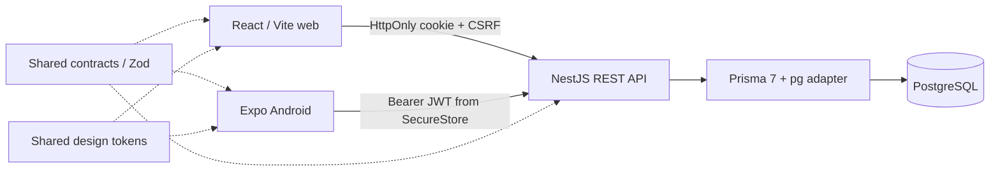

# Architecture and decisions

Still is a pnpm TypeScript workspace with a React/Vite web app, an Expo/React Native Android app, and **one NestJS REST API with one PostgreSQL database**. There are no mock-data client stores or separate mobile backend. Refresh retrieves the same persisted rows on both platforms.

`packages/contracts` owns exact display enums, input schemas, request/query types, response types and date semantics. Clients provide friendly form validation; API pipes independently parse every domain request. Strict objects reject injected fields such as ownerId. Business dates are real YYYY-MM-DD calendar dates, creation/update timestamps are server-generated UTC ISO strings. Names are trimmed, descriptions can be empty, project end dates must be on or after start dates. Pending counts only `Pending`; project status remains explicitly editable and independent of task progress. PUT requires the full editable representation.

`apps/api` separates controllers, services, authentication, configuration, response mapping, and the database provider. Project updates/deletes include ownerId in their write predicate. Task updates/deletes include the project's owner in their write predicate. Creation/reassignment checks the destination project inside a serializable transaction, retrying serialization conflicts up to three attempts. Inaccessible IDs return 404. Prisma uses parameterized queries; the health probe is a fixed SQL constant. Explicit response mapping omits hashes, owner IDs, and internal session rows.

JWTs include subject, session ID, issuer, audience, expiry and an HS256 signature. Every protected request validates the signature and active PostgreSQL session. Logout revokes that row before the client clears credentials. Web uses HttpOnly cookies, Secure cookies outside development, explicit credentialed CORS origins, trusted-Origin checks and a session-bound CSRF token for cookie mutations. CSRF is derived with HMAC, its digest is stored in the session; browser state retains it only in memory. Login/register enforce trusted browser origins and mobile uses `X-Client-Platform: mobile` to request a Bearer token. Tokens never enter browser localStorage. Android stores its token only in Expo SecureStore. Clients clear their per-user Query cache on logout/expiry and keep network errors distinct from expired sessions.

Auth endpoints allow 20 requests per 15 minutes per client IP. The baseline limiter is in process: deploy **one API replica** until a shared rate-limit store is added. `TRUST_PROXY_HOPS` defaults to zero and must match the host's actual proxy chain; never set an unconditional `trust proxy=true`. Logs include a generated request ID, method, path (no query strings), status, timing and sanitized error class. They omit bodies, authorization/cookie headers and DB exception details. JSON bodies are capped at 32 KB. Startup validates secrets, origin URLs and deployment HTTPS requirements. PostgreSQL uniqueness and foreign keys reinforce API validation.

TanStack Query caches server data per active account, invalidates after successful local mutations and refetches on refresh. Android uses pull-to-refresh and focus/network listeners. Mutation retries are disabled to avoid duplicate creations. Open form state remains mounted after recoverable network/server errors; session expiry deliberately ends that account's editing session. No offline mutation queue or durable draft storage is implemented. Bounded pages contain 24 items by default, at most 100. Project list order is created-date descending; tasks sort by due date ascending, with stable ID tie-breakers. Dynamic search/filter keys prevent stale filter results.

Web primitives follow shadcn/ui's owned-source pattern, Radix accessibility primitives and Tailwind 4 tokens. Native UI uses React Native inputs, Picker, Alert, safe areas and native navigation. Only contracts and tokens cross the platform boundary. UI states include loading, empty/no-results, validation, saved confirmations, retry, offline and expiry. The Figma artifact is an editable annotated wireframe/specification, not a pixel-identical export of the finished clients.

Version choices: Node 22, pnpm 11.18.0, React 19.2.3, Vite 8.3.3, Tailwind 4, NestJS 11.2.7, Prisma 7.10.0 and Expo SDK 56.0.23 / React Native 0.85.3. Native dependencies are pinned to Expo's installed bundledNativeModules matrix. Prisma 8 was a release candidate at selection time, so the supported stable Prisma 7 line was selected. Context7 and official docs informed the implementations; installed CLI/type definitions are the final compatibility check.

Build checks are distinct from feature verification. Automated tests and device/browser acceptance are deliberately deferred. No external repository, deployment or distribution service was created.
