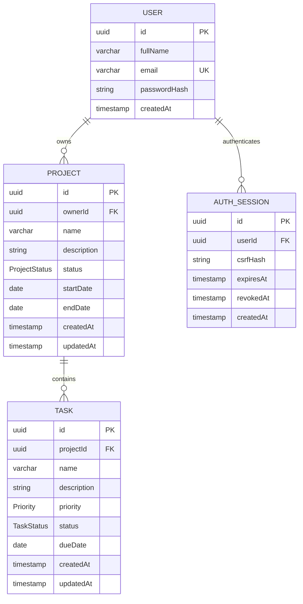

# Database schema

Source: `apps/api/prisma/schema.prisma` and `prisma/migrations/202610080001_init/migration.sql`. UUIDs are generated by Prisma; migration creation dates default to PostgreSQL's current timestamp, while Prisma supplies `updatedAt` on writes. Email is normalized to lowercase before database writes and has a unique index. Project ownership is a User foreign key; task ownership is derived through Project, with no redundant owner field. Session/user and project/owner deletions cascade; project deletion cascades to tasks. Indexes support owner/status/created-date lists, project/status/priority task queries and user/expiry session lookups. PostgreSQL enum labels match assignment display labels; generated Prisma enum keys are mapped to API display values by response DTOs.
